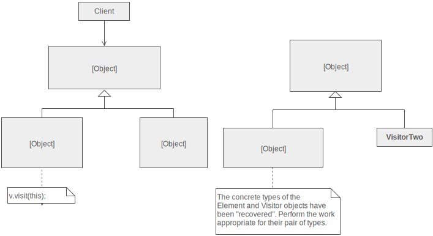
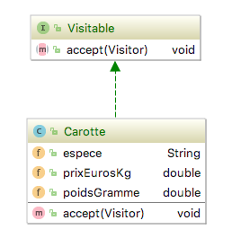
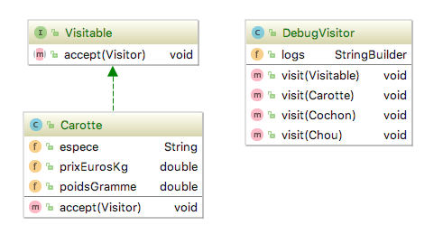
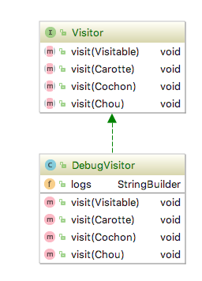

# isi3-tp3-visitor-composite

Philippe Charrière :octocat: [@k33g](https://github.com/k33g)

:warning: Si vous avez une question, créez une issue dams votre projet et notifiez moi avec [@k33g](https://github.com/k33g)

> Le rapport est à saisir dans le ficher [RAPPORT.md](RAPPORT.md) en utilisant le [formalisme MarkDown](https://guides.github.com/features/mastering-markdown/)

## Exercice 0

Vous venez d'ouvrir votre restaurant et vous devez faire la liste de ce que vous avez pour préparer votre repas.

Donc si j'ai:

```java
Carotte carotte = new Carotte();
Chou chou = new Chou();
Chou unAutrechou = new Chou();
Cochon cochon = new Cochon();
Cochon cochonou = new Cochon();
```

Je veux pouvoir sortir un rapport simple:

```text
Carotte: Espèce:jaune
Chou: Couleur:rouge
Chou: Couleur:rouge
Cochon: Pays:Mexique
Cochon: Pays:Mexique
```

### Discutons

- présentez votre solution
- conclusion(s) ?


## Exercice 1

Je veux savoir pour combien j'ai acheté de marchandise (toujours à partir des mêmes classes)

```text
Carotte: 1.5 Euros
Chou: 1.2195 Euros
Chou: 1.2195 Euros
Cochon: 2180.0 Euros
Cochon: 2180.0 Euros
4363.939
```

### Discutons

- présentez votre solution
- conclusion(s) ?


## Rappel: le pattern Visiteur



- vous avez des choux, carottes, ... globalement des classes avec des structures différentes
- vous souhaitez exécutez des traitements "du même type" dessus/avec
- il faut les rendres **"visitables"** (elles vont implémenter une interface `Visitable`)



- il faut faire un **"visiteur"** qui va s'occuper de gérer les traitements en fonction des différents types





```java
// montrer l'exemple 😉
```


## Exercice 2

- Implémentez 2 visiteurs (et rendez vos classes "visitables") pour refaire les 2 exercices précédents


## Exercice 3

- Implémentez un visteur pour faire un export JSON de vos instances de classes

## Exercice 4

- même chose que l'exercice 3 mais avec un visiteur qui aurait une seule méthode (en utilisant la réflexion)

## Ressources

- https://sourcemaking.com/design_patterns/visitor
- https://refactoring.guru/design-patterns/visitor